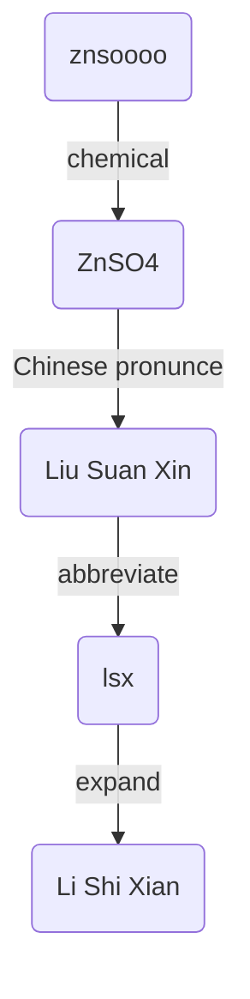

# Hi, I am lsx! 👋

 
  Visitor count 
  

## My Hobbies

- 🔭 I’m currently working on C/C++
- 🌱 I’m currently learning Python
- 👯 I’m looking to collaborate on __IDLE-Advance__
- 🤔 I’m looking for help with __IDLE-Advance__
- 💬 Ask me about Python using
- 📫 How to reach me: lsx7@sina.com
- 😄 Pronouns: znsoooo, Shixian Li, He
- ⚡ Fun fact: 

## My Projects

### Python Library
- ★★★★★
- [x] <!--20210508--> https://github.com/znsoooo/IDLE-Advance
- [x] <!--20211029--> https://github.com/znsoooo/lishixian
- ★★★
- [ ] <!--20240809--> https://github.com/znsoooo/npp-select-in-brackets

### Desktop Application
- ★★★★★
- [x] <!--20220426--> https://github.com/znsoooo/qr-desktop
- [x] <!--20230421--> https://github.com/znsoooo/regex-matcher
- [x] <!--20230811--> https://github.com/znsoooo/find-in-files
- ★★★
- [x] <!--20190406--> https://github.com/znsoooo/contacts
- [x] <!--20190511--> https://github.com/znsoooo/qrcode
- [ ] <!--20231002--> https://github.com/znsoooo/ChangelistCommitter
- [ ] <!--20240101--> https://github.com/znsoooo/mini-editor
- [x] <!--20240831--> https://github.com/znsoooo/binary-image-viewer
- [ ] <!--20241207--> https://github.com/znsoooo/double-check
- ★
- [ ] <!--20221225--> https://github.com/znsoooo/sudoku
- [x] <!--20221228--> https://github.com/znsoooo/wordle-assistant
- [x] <!--20231216--> https://github.com/znsoooo/2048
- [x] <!--20231216--> https://github.com/znsoooo/yolo-labeling
- ×
- [x] <!--20221112--> https://github.com/znsoooo/ImageClassifier

### Tool Box
- ★★★★★
- [x] <!--20200531--> https://github.com/znsoooo/toolkits
- [x] <!--20231203--> https://github.com/znsoooo/c-utils
- ★★★
- [x] <!--20220707--> https://github.com/znsoooo/python-portable
- [x] <!--20231111--> https://github.com/znsoooo/SendTo
- [x] <!--20240601--> https://github.com/znsoooo/lisp-parser
- ★
- [ ] <!--20231128--> https://github.com/znsoooo/numpy4c
- [ ] <!--20240709--> https://github.com/znsoooo/c-parser
- [ ] <!--20240712--> https://github.com/znsoooo/vhdl-parser

### Source Code
- ★
- [x] <!--20180302--> https://github.com/znsoooo/wxAvatars
- [x] <!--20191209--> https://github.com/znsoooo/MarriageStatistics
- [x] <!--20210123--> https://github.com/znsoooo/PictureWall
- [x] <!--20240618--> https://github.com/znsoooo/opencv-calc-rotated-iou

### Collections
- ★
- [ ] <!--20180302--> https://github.com/znsoooo/Age18
- [ ] <!--20210609--> https://github.com/znsoooo/znsoooo
- [ ] <!--20220226--> https://github.com/znsoooo/blog
- [ ] <!--20241206--> https://github.com/znsoooo/color

### Only Test
- ★
- [ ] <!--20220611--> https://github.com/znsoooo/HelloWorld
- ×
- [ ] <!--20171225--> https://github.com/znsoooo/test-git
